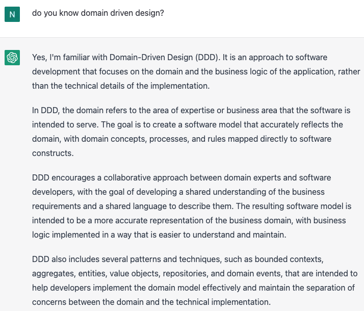

# DDD (Domain Driven Design)

## DDD vs OOP?
OOP : 패러다임(함수형 등)
DDD : 방법론(TDD, BDD 등)

DDD와 다른 TDD, BDD의 차이점으로 DDD는 개발자 외에도 기획자, 도메인 전문가 등 프로덕트 팀 단위의 역량이 필요한 협업 방법론이라고 할 수 있음.  
객체지향의 역사는 길지만 개인적인 느낌으로는 best practice가 DDD라고 생각되어 정리하게 되었다.

## DDD 특징
* 도메인의 모델과 로직에 집중
    * System, Infrastructure 등 기술적인 부분이 아닌 핵심 도메인 비즈니스에 집중하는 방법론
* 보편적 언어 사용
    * 프로덕트 팀 구성원이 동일한 언어를 사용
* Software Entity와 Domain 간 개념의 일치
    * 코드가 곧 설계를 의미
    * Entity 클래스만 봐도 Domain 간 연관 관계, 중요도의 차이(Aggregate), 비즈니스 복잡도를 이해하는데에 도움을 받을 수 있음.

## DDD 주요 개념
* Bounded Context
  * 범위를 구분하는 하위 도메인 개념.
* Context Map
  * Bounded Context 간 관계를 보여준다.
* Aggregate
  * 데이터 변경 단위, 일관성 있게 변경되어야 하는 Entity 집합체로 볼 수 있다.

## 프랙티스
* [DDD 코어](./ddd_core/README.md) : DDD 개념을 코드로 옮긴다.
* [자동차 공장](./car_factory/README.md) : 자동차 공장을 예로 들어 작성한 DDD 예시

## ChatGPT에게 물어본 DDD

ChatGPT에게 DDD에 대해 물어보니 상세하게 잘 정리해줘서 참 유용한 것 같다.
본 블로깅에서는 DDD에 대해 정리해보겠다.

## Reference
* 도메인 주도 설계 핵심 - 반 버논 (번역본) : https://product.kyobobook.co.kr/detail/S000001804574
* ㄷㄷㄷ: Domain Driven Design과 적용 사례공유 / if(kakao)2022 https://youtu.be/4QHvTeeTsj0