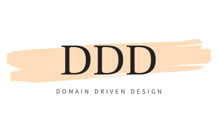
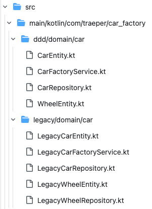

# DDD 프랙티스 #1 자동차 공장

DDD스러운 코드를 작성하는 방법을 탐구하는 자동차 공장 예제.
JPA 기반으로 작성한 예제이며 보다 핵심 도메인에 집중할 수 있는 장점이 있음을 확인할 수 있었다.
README.md와 코드를 각각 켜놓고 읽는 것을 추천한다.

## 자동차 공장 설명
Domain 간 유기적인 관계를 크게 이용하지 않는 [legacy](./src/main/kotlin/com/traeper/car_factory/legacy) 예제와 JPA의 여러 옵션을 활용하여 Aggregate 내부의 일관성을 유지하고 도메인에서 핵심이 되는 Aggregate Root등을 파악하기 쉬운 [ddd](./src/main/kotlin/com/traeper/car_factory/ddd) 예제를 작성하였다.

자동차 공장에는 자동차, 바퀴 개념이 존재하는데 자동차 없는 바퀴는 존재하지 않는 것을 전제로 하여 자동차는 Aggregate Root, 바퀴는 자동차에 포함되어 생성 및 삭제되는 종속적인 개념으로 가정한다. 즉 시스템의 핵심을 자동차에 두었을 때 코드를 작성하였다.

### legacy vs ddd 비교 미리보기

legacy가 ddd에 비해 WheelRepository를 하나 더 가지고 있는 것을 볼 수 있다. 단순히 파일 목록만 보면 바퀴의 지위와 쓰임새가 자동차와 동등한 수준일 수도 있다는 생각이 든다. 물론 바퀴와 자동차를 보면 누구나 자동차가 핵심이라고 생각할 것이지만 실제로 도메인이 복잡한 현업에서는 어떤 객체가 더 핵심인지 한 눈에 살펴보기 힘들 수 있을 수 있다.  

### legacy 예제
자동차([LegacyCarEntity](./src/main/kotlin/com/traeper/car_factory/legacy/domain/car/LegacyCarEntity.kt))에 바퀴를 OneToMany로 붙여서 fetch join까지는 활용하도록 했지만 자동차와 바퀴는 엄연히 독립적으로 관리되는 것을 알 수 있다. [테스트코드](./src/test/kotlin/com/traeper/car_factory/legacy/domain/car/LegacyCarFactoryServiceTest.kt)를 보면 바퀴 Repository가 독립적으로 존재하여 관리되므로 바퀴가 자동차에 완전히 종속적인 개념인지 알기 어렵다. 즉 코드를 봤을 때 어떤 개념이 프로젝트의 핵심이 되는지 한 눈에 알기 어렵다.

### ddd 예제
자동차([CarEntity](./src/main/kotlin/com/traeper/car_factory/ddd/domain/car/CarEntity.kt)도 바퀴를 마찬가지로 OneToMany으로 관리하는데 legacy와 다른 점은 Cascade 옵션을 주어 자동차가 생성, 삭제될 때 바퀴도 따라 생성, 삭제되는 것이다. 바퀴 Repository가 존재하지 않아 바퀴를 직접적으로 제어할 수 없는 것을 볼 수 있다. 즉 바퀴는 독립적으로 존재할 수 없는 개념인 것과 동시에 자동차에 종속된 것을 알 수 있다. 그리고 자동차와 바퀴에 AggregateRoot와 DomainEntity interface를 붙여 둘의 관계를 명확하게 표현하였다. 

[테스트코드](./src/test/kotlin/com/traeper/car_factory/ddd/domain/car/CarFactoryServiceTest.kt)를 보면 바퀴 Repository가 더는 존재하지 않고 자동차에 초점이 맞춰진 것을 볼 수 있다.

## 질문
* 새로운 요구사항으로 인해 만약 바퀴가 Aggregate Root로 승격하는 경우는 없을까? 이런 경우 자동차와 다른 Aggregate로 개발되어야 되는데 그럴 때는 자동차와 바퀴 관계를 어떻게 개발해야 할까?